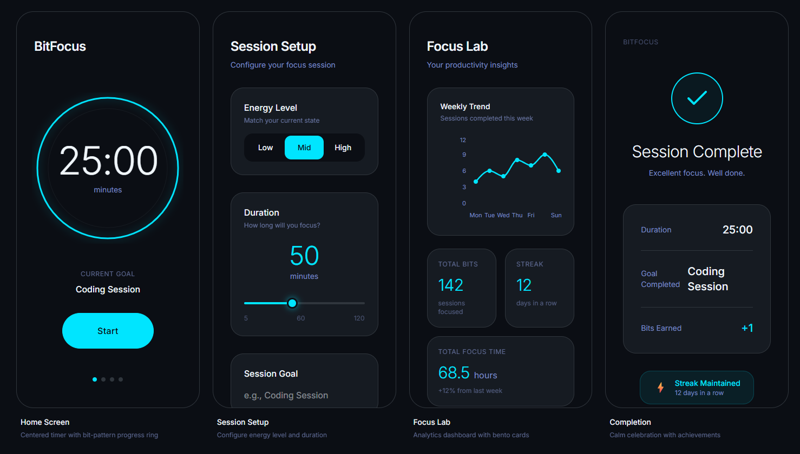

# 🎯 BitFocus

**BitFocus** é um aplicativo de produtividade de alto desempenho desenvolvido para Android, focado em ajudar usuários a atingirem o estado de "deep work" através de ciclos de foco otimizados, metas claras e acompanhamento de níveis de energia.




---

## 📱 Visual do Aplicativo

O BitFocus utiliza uma linguagem visual moderna baseada em "Bento Cards" e elementos neon para reduzir a carga cognitiva e aumentar a imersão:

- **Home Screen**: Timer centralizado com anel de progresso estilizado.
- **Session Setup**: Configuração intuitiva de níveis de energia e duração.
- **Focus Lab**: Dashboard de análise com gráficos de tendências semanais.
- **Completion**: Celebração de conquistas e manutenção de streaks.

---

## 🚀 Funcionalidades Principais

- **Timer de Foco Inteligente**: Um timer customizado que utiliza princípios de gamificação e feedback visual (Progress Rings) para manter o usuário engajado.
- **Gestão de Metas**: Definição de objetivos claros para cada sessão de foco, garantindo que cada minuto seja intencional.
- **Acompanhamento de Energia**: Monitoramento dos níveis de energia e foco durante as sessões para identificar padrões de produtividade.
- **Insights & Analytics**: Visualização de progresso e dados históricos para otimização da rotina.
- **UI Moderna & Adaptativa**: Design inspirado em interfaces futuristas (Electric Cyan & Dark Slate) com suporte completo a ícones adaptativos e animações fluidas via Lottie.

---

## 🛠️ Stack Tecnológica

O projeto foi construído utilizando as melhores práticas de desenvolvimento Android moderno:

- **Linguagem**: [Kotlin](https://kotlinlang.org/) (Coroutines + Flow)
- **Interface de Usuário**: [Jetpack Compose](https://developer.android.com/jetpack/compose)
- **Injeção de Dependência**: [Hilt (Dagger)](https://developer.android.com/training/dependency-injection/hilt-android)
- **Banco de Dados**: [Room](https://developer.android.com/training/data-storage/room) (Persistência offline)
- **Preferências**: [DataStore](https://developer.android.com/topic/libraries/architecture/datastore)
- **Background Tasks**: [WorkManager](https://developer.android.com/topic/libraries/architecture/workmanager)
- **Arquitetura**: **Clean Architecture** (Separando responsabilidades em camadas: Data, Domain e UI)
- **Navegação**: [Compose Navigation](https://developer.android.com/jetpack/compose/navigation)

---

## 🏗️ Arquitetura do Projeto

O BitFocus segue uma estrutura modular e escalável:

### 1. Data Layer (`data/`)
- **Local**: Implementação do Room DAO e Data Sources para armazenamento local.
- **Repository Impl**: Implementação concreta dos repositórios, gerenciando a fonte de dados.

### 2. Domain Layer (`domain/`)
- **UseCases**: Contém a lógica de negócio pura (ex: `HomeUseCase` para gerenciar o timer).
- **Repository Interfaces**: Contratos que definem como os dados devem ser acessados.

### 3. UI Layer (`ui/`)
- **Presentation**: Implementação de ViewModels (usando `StateFlow`) e Telas (Composables).
    - `Home`: O centro de controle do timer.
    - `Setup`: Configuração de novas sessões.
    - `Lab`: Área experimental de insights.
- **Components**: Componentes de UI reutilizáveis (Botões, Timers, Ícones Customizados).
- **Navigation**: Definição das rotas e fluxos do aplicativo.

---

## 🎨 Design System

O aplicativo utiliza uma paleta de cores personalizada para reduzir o cansaço visual e aumentar o foco:

- **Electric Cyan**: Usado para ações principais e progresso.
- **Dark Slate / Deep Charcoal**: Cores de fundo para garantir contraste e conforto em ambientes escuros.
- **Soft Blue / Periwinkle**: Cores de suporte para informações secundárias.

---

## 🔧 Como Rodar o Projeto

1. Clone o repositório:
   ```bash
   git clone https://github.com/vitorcsouza/BitFocus.git
   ```
2. Abra o projeto no **Android Studio (Ladybug ou superior)**.
3. Certifique-se de ter o SDK 35 instalado.
4. Sincronize o Gradle e execute no seu dispositivo ou emulador.

---

## 📄 Licença

Este projeto está sob a licença de uso pessoal de Vitor Souza. Consulte os termos para mais detalhes.

---
*Desenvolvido com ❤️ por [Vitor Souza](https://github.com/vitorcsouza)*
